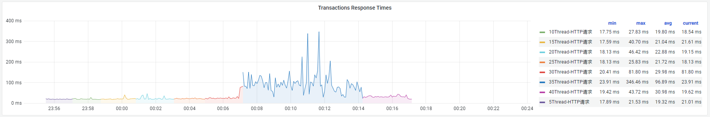

# **JVM 虚拟机**压测

1. **响应时间优先策略-低延时接口：**

   **RT：**

   

   **TPS：**

   

   **GC信息：**

   

   **堆内存统计信息：**

   

   **吞吐量：**

   

   **内存以及IO信息：**

   

   

2. **吞吐量优先策略-低延时间接口：**

​	**RT:**

​	**TPS:**

​	**GC信息：**

​	**堆内存统计信息：**

​	**吞吐量：**

​	**内存以及IO信息：**

3. **全功能垃圾收集器-低延时接口：**

​	**RT：**

​	**TPS:**

​	**GC信息：**

​	**吞吐量：**

​	**堆内存统计信息：**

​	**内存以及IO信息：**

4. **响应时间优先策略-高延时接口：**

​	**RT：**

​	**TPS:**

​	**GC信息：**

​	**堆内存统计信息：**

​	**内存以及IO信息：**

5. **吞吐量优先策略-高延时接口：**

​	**RT：**

​	**TPS：**

​	**GC信息：**

​	**吞吐量：**

​	**堆内存统计信息：**

​	**内存以及IO信息：**

6. **全功能垃圾收集器-高延时接口：**

​	**RT：**

​	**TPS：**

​	**GC信息：**

​	**吞吐量：**

​	**堆内存统计信息：**

​	**内存以及IO信息：**

