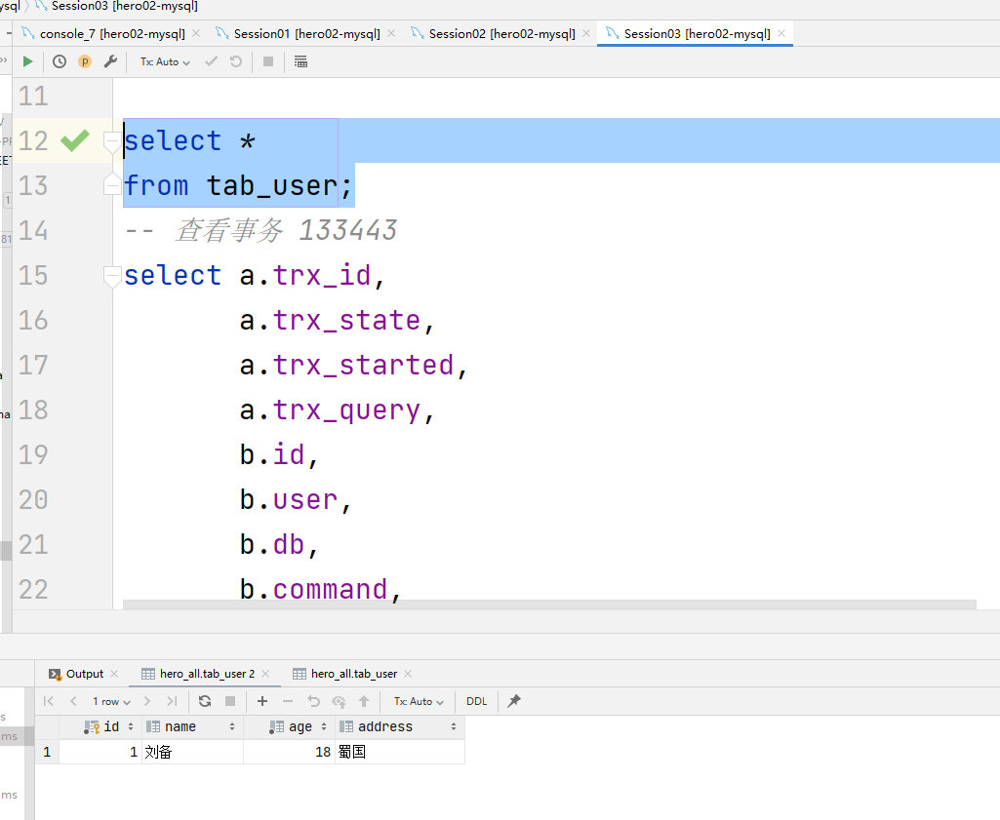

# 题目 01- 完成ReadView案例，解释为什么RR和RC隔离级别下看到查询结果不一致

**脚本准备：**

**案例 01- 读已提交 RC 隔离级别下的可见性分析：**

**目标：** session01 执行后未提交前 查询结果为刘备，seesion01提交，session02执行未提交时，查询结果为张飞， seesion02提交后，查询结果为诸葛亮

1. 三个session都开启事务，执行 begin;

2. 执行 session01 的两个 update 语句， session01 此时有一个活跃的事务

3. 提交 session01, 执行 session02 的两个 update 语句，此时session03 查询结果是张飞

4. 提交 session02, 此时 session03 查询结果是诸葛亮

**结论：** 使用RC隔离级别的事务在每次查询开始时都会生成一个独立的ReadView

**案例 02- 可重复读 RR 隔离级别下的可见性分析：**

**目标：** session01 执行后未提交前 查询结果为刘备，seesion01提交，session02执行未提交时，查询结果为张飞， seesion02提交后，查询结果为诸葛亮

1. 回滚表结构，调整隔离级别为repeatable read，开启事务

2. 执行session01 的脚本，并进行提交，session03查询结果为刘备

3. 执行session02脚本，session03查询结果为刘备

4. 提交session02脚本, session03查询结果为刘备

**结论：** 两次 SELECT 查询得到的结果是重复的，记录的列 c 值都是 '刘备'，使用 RR 隔离级别的事务来说，只会在第一次
执行查询语句时生成一个 ReadView ，之后的查询就不会重复生成了。

# 题目 02- 什么是索引？

索引是帮助mysql高效获取数据的数据结构

**优点：** 

1. 可以提高数据检索的效率，降低数据库的IO成本
2. 通过索引列对数据进行排序，降低数据排序的成本，降低了CPU的消耗

**缺点：**

1. 索引会占据磁盘空间
2. 索引虽然会提高查询效率，但是会降低更新表的效率

**索引的分类：**

1. 单列索引：索引中只有一个列
   1. 主键索引：索引列中的值必须是唯一的不允许有空值。
   2. 普通索引：MySQL中基本索引类型，没有什么限制，允许在定义索引的列中插入重复值和空值。
   3. 唯一索引：索引列中的值必须是唯一的，但是允许为空值。
   4. 全文索引：只能在文本类型CHAR，VARCHAR，TEXT类型字段上创建全文索引。
   5. 空间索引：MySQL在5.7之后的版本支持了空间索引，而且支持OpenGIS几何数据模型
   6. 前缀索引：在文本类型如CHAR，VARCHAR，TEXT类列上创建索引时，可以指定索引列的长度，
      但是数值类型不能指定。
2. 组合索引：使用2个以上的字段创建的索引，使用需要遵循最左前缀原则

**索引创建的原则，注意事项：**

需要创建索引：
1. 频繁出现在where 条件字段，order排序，group by分组字段
2. select 频繁查询的列，考虑是否需要创建联合索引（覆盖索引，不回表）
3. 多表join关联查询，on字段两边的字段都要创建索引

索引优化：
1. 表记录很少不需创建索引，索引会有存储的开销
2. 一个表的索引个数不能过多：每个索引都是一个索引树，会浪费空间；表更新变慢，需要更新所有的索引树。太多的索引也会增加优
   化器的选择时间。应该只为需要的列创建索引。
3. 频繁更新的字段不建议作为索引：频繁更新的字段引发频繁的页分裂和页合并，性能消耗比较高
4. 区分度低的字段，例如性别，状态，由于回表查询的消耗，使用索引，比全表扫描的性能还要差。
5. 在InnoDB存储引擎中，主键索引建议使用自增的长整型，避免使用很长的字段：主键值越
    长，一个页可存储的数据量就会越少，查询时磁盘IO次数会增多，查询效率会降低。
6. 不建议用无序的值作为索引：例如身份证、UUID。更新数据时会发生频繁的页分裂，页内数据不
    紧凑，浪费磁盘空间。
7. 尽量创建组合索引，而不是单列索引：一方面节省空间，另一方面可以使用覆盖索引，组合索引在创建时应该把频繁用到的列、区分度高的值放在前面。频繁使用代表索引的利用率
   高，区分度高代表筛选粒度大，这样做可最大限度利用索引价值，缩小筛选范围

**如何知道SQL是否用到了索引：**

在select语句前加上explain关键字，type如果是all，那说明这条查询语句遍历了所有的行，并没有使用到索引，如果为其他则使用了索引

**索引的原理：**

mysql索引的数据结构是B+树，只有叶子节点才会存储数据，非叶子节点只存储键值。叶子节点之间使用双向指针连接，最
底层的叶子节点形成了一个双向有序链表。B+树的最底层叶子节点包含所有索引项。具备中路返回特性。

# 题目 03- 什么是MVCC？

MVCC全称叫多版本并发控制，是RDBMS常用的一种并发控制方法，用来对数据库数据进行并发访问，
实现事务。。核心思想是读不加锁，读写不冲突。

Redo日志记录了事务的行为，可以很好地通过其对页进行“重做”操作。但是事务有时还需要进行回滚操
作，这时就需要undo。

ReadView是张存储事务id的表，主要包含当前系统中有哪些活跃的读写事务，把它们的事务id放到一个
列表中。。结合Undo日志的默认字段【事务trx_id】来控制哪个版本的Undo日志可被其他事务看见。

判断可见性的方式为：开启事务执行第一次查询时，首先生成ReadView，然后依据Undo日志和ReadView按照判断可见性。具体循环规则如下：
1. 如果被访问版本的 trx_id 属性值，小于ReadView中的事务下限id，表明生成该版本的事务在生
   成 ReadView 前已经提交，所以该版本可以被当前事务访问。
2. 如果被访问版本的 trx_id 属性值，等于ReadView中的 m_creator_trx_id ，可以被访问.
3. 如果被访问版本的 trx_id 属性值，大于等于ReadView中的事务上限id，在生成 ReadView 后才产
   生的数据，所以该版本不可以被当前事务访问。
4. 如果被访问版本的 trx_id 属性值，在事务下限id和事务上限id之间，那就需要判断是不是在
   m_ids 列表中。如果在，说明创建 ReadView 时生成该版本的事务还是活跃的，该版本不可以被访问；如果不在，说明创建 ReadView 时生成该版本的事务已经被提交，该版本可以被访问。

循环判断Undo log中的版本链某一的版本是否对当前事务可见，如果循环到最后一个版本也不可见的
话，那么就意味着该条记录对该事务不可见，查询结果就不包含该记录。