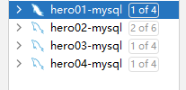

# 题目01-搭建一主三从集群

1. 首先在四台服务器上安装mysql
   
   
2. 修改 mysql 配置文件 my.cnf 开启 binlog，之后重启 mysql 服务
   
   
3. 主机给从机授备份权限
   
4. 刷新权限后查看 master 状态
   
5. 配置从服务器

   
6. 重启并登录到 MySQL 进行配置 Slave
   

   启动并检查复制功能状态
   

   验证下来能成功复制
   
7. 同样配置另外两个从服务器

   一主三从搭建完成
   
   测试数据同步无误

   
8. 配置springboot sharding配置

# 题目02-搭建高可用集群
1. 配置双主集群
   * 修改 master1 配置 新增一个 slave
   
   * 修改 master2 配置 
   
2. 安装 keeplive
   
3. 调整配置文件
   
4. 编写检查脚本
   
5. 安装 配置 mycat 
   
6. mycat 成功启动
   
   