# 题目01-搭建MongoDB高可用集群
1. 安装 mongodb
    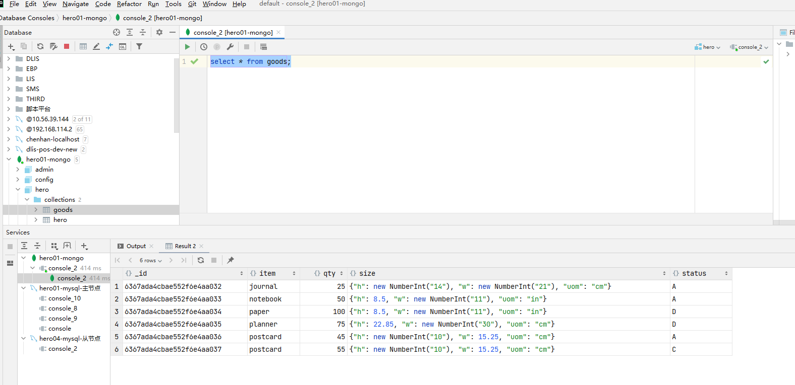
2. 初始化集群数据文件存储目录和日志文件, 创建集群配置文件目录
    
3. 主节点配置
    ```properties
    tee /root/mongocluster/mongo_37017.conf <<-'EOF'
    # 主节点配置
    dbpath=/data/mongo/data/server1
    bind_ip=0.0.0.0
    port=37017
    fork=true
    logpath=/data/mongo/logs/server1.log
    # 集群名称
    replSet=heroMongoCluster
    EOF
    ```
4. 从节点1配置
    ```properties
    tee /root/mongocluster/mongo_37018.conf <<-'EOF'
    dbpath=/data/mongo/data/server2
    bind_ip=0.0.0.0
    port=37018
    fork=true
    logpath=/data/mongo/logs/server2.log
    replSet=heroMongoCluster
    EOF
    ```
5. 从节点2配置
    ```properties
    tee /root/mongocluster/mongo_37019.conf <<-'EOF'
    dbpath=/data/mongo/data/server3
    bind_ip=0.0.0.0
    port=37019
    fork=true
    logpath=/data/mongo/logs/server3.log
    replSet=heroMongoCluster
    EOF
    ```
6. 配置启动和关闭脚本
    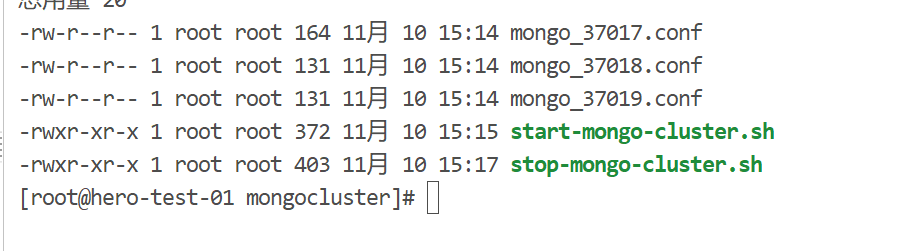
7. 启动脚本
    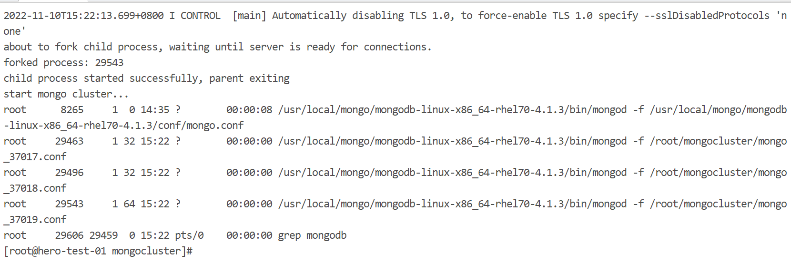
8. 进行分片配置
    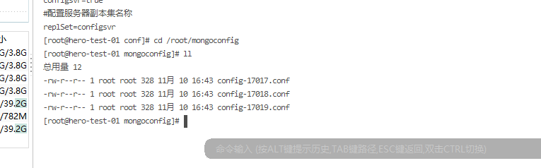
9. 配置分片集群开启和关闭脚本
    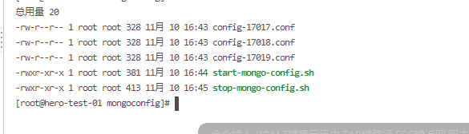
10. 启动分片集群，配置节点
    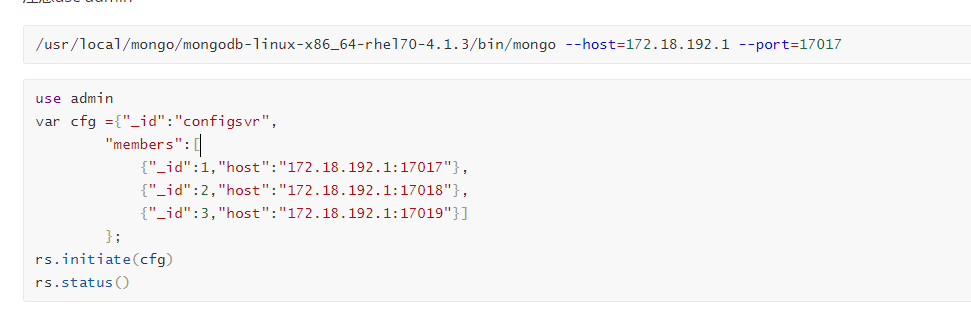
11. 配置 shard1和shard2集群 以及创建脚本
   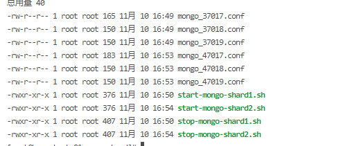
12. 配置和启动路由节点，配置分片节点
    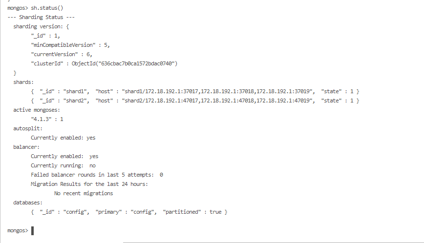
13. 插入数据验证，37017中有 47017中没有
    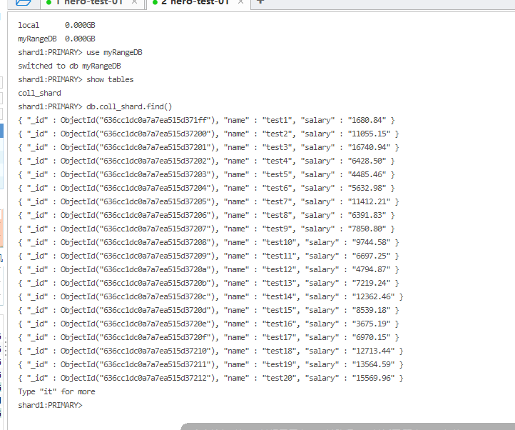
    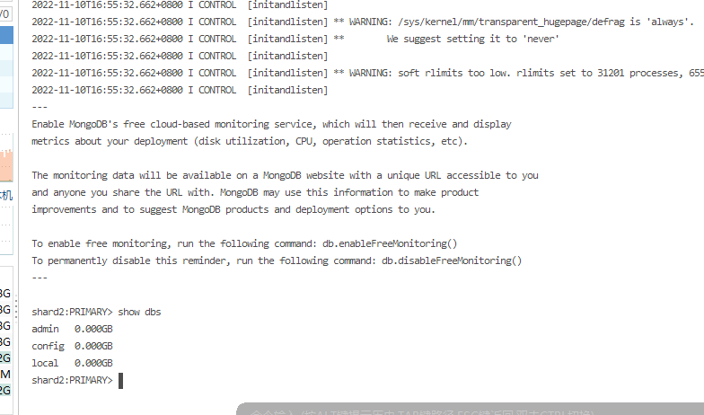
14. 启动项目，执行插入方法
    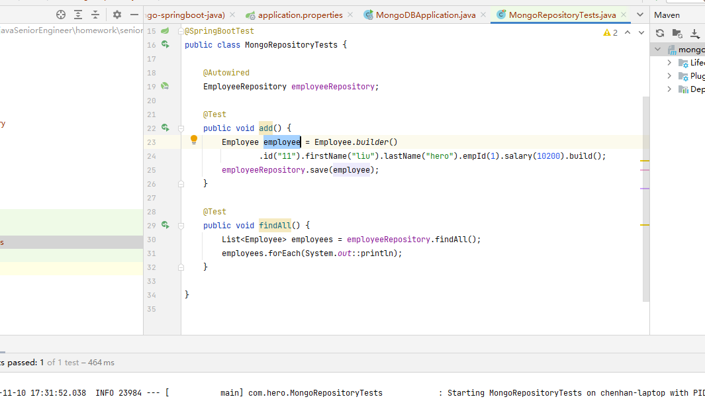
15. 检查数据，在47017中有数据，在37017中无数据，分片验证成功
    
    
    
    
    
    