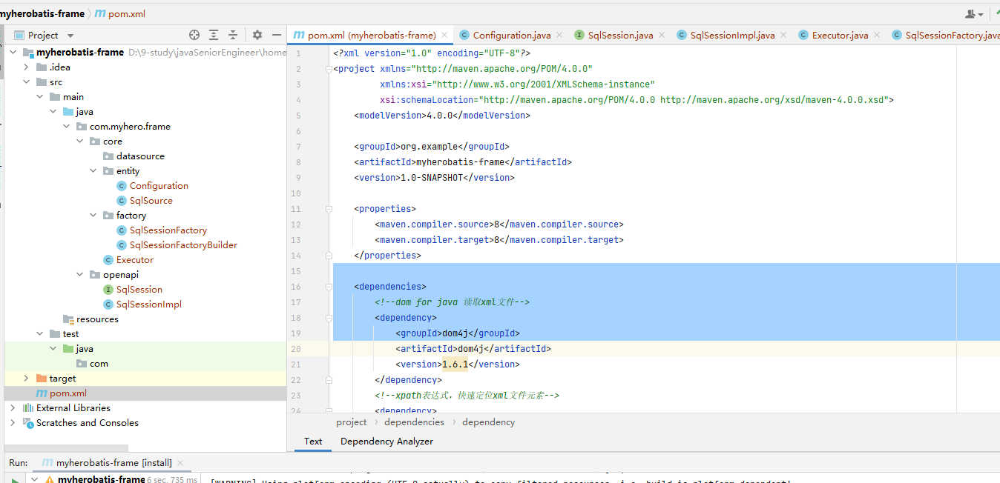
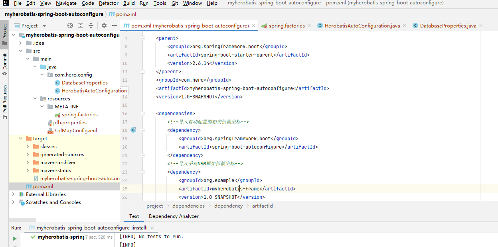
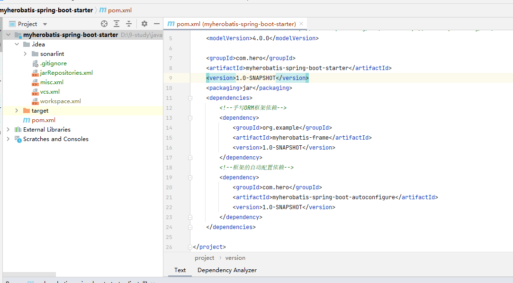
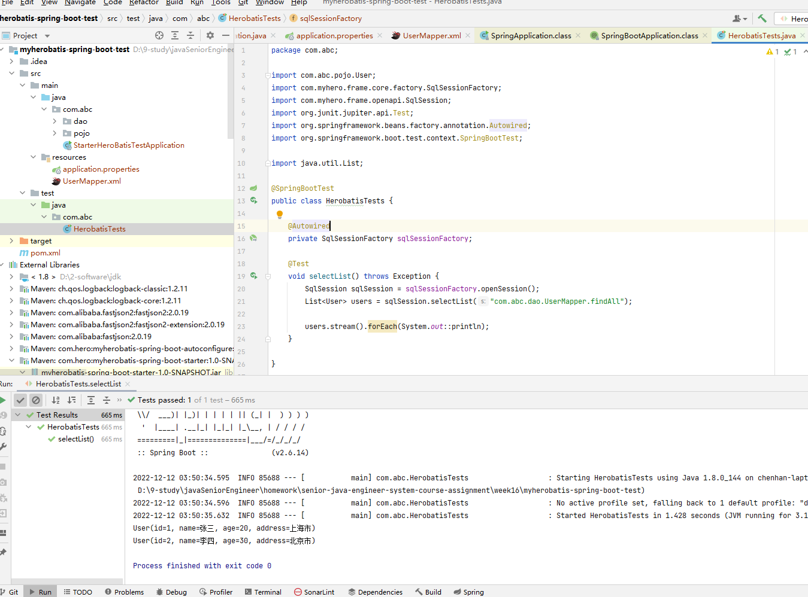

# 题目 01- 请简单说说你对 SpringBoot 的理解以及它与 Spring 的关系

SpringBoot 的设计初衷：

1. 为了优化 Spring 应用的开发方式
2. 开箱即用，同时可以快速扩展
3. 嵌入式的 Tomcat
4. 没有冗余代码，不需要 XML 配置

SpringBoot 的核心功能：

1. 核心能力：
   1. Spring 容器
   2. 日志
   3. 自动配置 AutoConfiguration
   4. 依赖导入 Starters
2. web 应用能力：
   1. MVC
   2. 嵌入式 Web 服务器
3. 数据访问（持久化）：
   1. 关系型数据库
   2. 非关系型数据库
4. 强大的整合其他技术的能力
5. 强大的应用测试能力

SpringBoot 是基于 Spring 的一套开发整合包

SringBoot 的缺点是传统项目要改造为 SpringBoot 比较困难，并且屏蔽了很多底层内容，使得开发容易忽视。

# 题目 02- 什么是 SpringBoot 的 starter?

starters 是依赖关系的整理和封装。

由于 Maven 的依赖管理继承了父类的依赖清单 BOM， 所以 starters 不需要写版本。

# 题目 03-SpringBoot 的 自动化配置 是如何实现的？

SpringBoot 采用约定大于配置设计思想，每一个 starter 会有一个对应的自动配置。

在启动类的注解 @SpringBootApplication 中 进入 @EnableAutoConfiguration 注解， 再进入  @Import({AutoConfigurationImportSelector.class})

AutoConfigurationImportSelector 类中 会去spring.factories 中查找是否有配置类, 然后将自动配置类加载到了 Spring 容器中。

# 题目 04- 请结合你做过的框架完成 SpringBoot 集成，自定义 starter 与自动配置

1. ORM 框架
   

2. 创建 myherobatis-spring-boot-autoconfigure 模块, 导入 ORM 框架

3. 创建 myherobatis-spring-boot-starter模块，导入 自动配置依赖 和 ORM 框架依赖

4. 创建 myherobatis-spring-boot-test 测试工程，导入 自定义的starter，测试结果如下，能成功查询：

